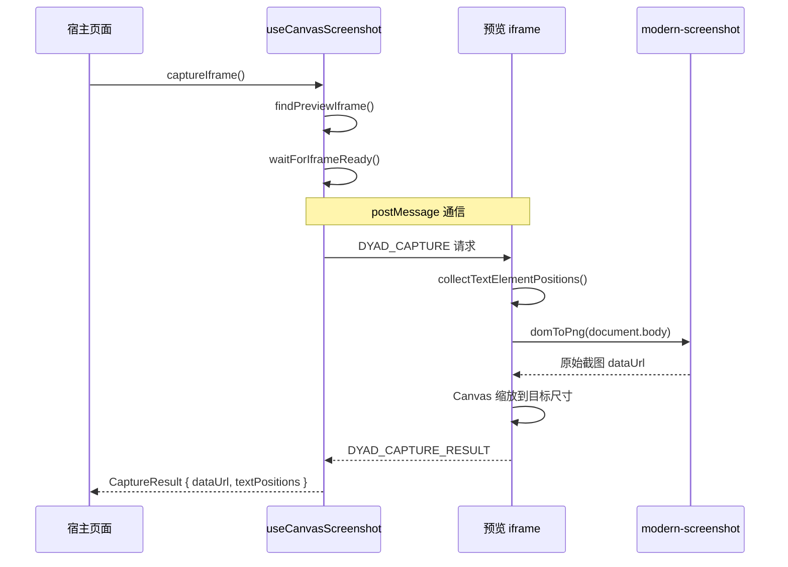

# 生成代码后截图技术文档（可移植）

本文档详细描述 **Design-Board (Dyad)** 项目中 **AI 生成代码 → 自动截图** 的技术实现，适合给其他 AI 或开发者阅读并移植到其他产品。

---

## 📋 技术概述

该技术实现了以下能力：
1. **iframe 内截图**：在 WebContainer 运行的 iframe 中对渲染后的页面进行截图
2. **postMessage 通信**：宿主页面与 iframe 通过消息协议协调截图流程
3. **Canvas 锚点标注**：在截图上绘制标注（锚点、编号等）
4. **文本位置采集**：可选地采集页面中文本元素的位置信息（用于规范检测）

---

## 🏗 架构概览

```
┌─────────────────────────────────────────────────────────────────┐
│                     宿主页面 (Next.js)                           │
│  ┌─────────────────────────────────────────────────────────────┐│
│  │  useCanvasScreenshot Hook                                   ││
│  │  ├── captureIframe()     发起截图请求                       ││
│  │  ├── waitForIframeReady() 等待 iframe 就绪                  ││
│  │  └── waitForCaptureResponse() 等待截图结果                  ││
│  └─────────────────────────────────────────────────────────────┘│
│                         ↕ postMessage                           │
│  ┌─────────────────────────────────────────────────────────────┐│
│  │  iframe (WebContainer 中运行的 Vite 预览)                   ││
│  │  ├── main.tsx 注入截图客户端代码                            ││
│  │  ├── 监听 DYAD_CAPTURE 消息                                 ││
│  │  ├── 调用 modern-screenshot (domToPng)                      ││
│  │  └── 返回 DYAD_CAPTURE_RESULT                               ││
│  └─────────────────────────────────────────────────────────────┘│
└─────────────────────────────────────────────────────────────────┘
                         ↓
┌─────────────────────────────────────────────────────────────────┐
│  generateAnnotatedThumbnail()                                   │
│  ├── 在 Canvas 上绘制锚点标注                                  │
│  └── 导出 base64 data URL                                      │
└─────────────────────────────────────────────────────────────────┘
```

---

## 📁 核心文件

| 文件路径 | 职责 |
|---------|------|
| `src/hooks/useCanvasScreenshot.ts` | 宿主页面截图 Hook，发起截图请求并处理响应 |
| `src/lib/webcontainer.ts` | 动态注入 iframe 截图客户端代码到 main.tsx |
| `src/lib/generateAnnotatedThumbnail.ts` | 在截图上绘制锚点标注（单版本） |
| `src/lib/generateFusionAnnotatedThumbnail.ts` | 在截图上绘制锚点标注（多版本融合场景） |

---

## 🔧 技术细节

### 1. 截图库选型：modern-screenshot

使用 [modern-screenshot](https://www.npmjs.com/package/modern-screenshot) 替代 html2canvas：

```json
// package.json
{
  "dependencies": {
    "modern-screenshot": "^4.4.44"
  }
}
```

**选择理由**：
- ✅ 使用 SVG foreignObject，中文字体支持更好
- ✅ 比 html2canvas 更轻量
- ✅ 更好的 CSS 兼容性

---

### 2. 消息协议

#### 请求消息 (宿主 → iframe)

```typescript
type DyadCaptureRequest = {
  type: 'DYAD_CAPTURE';
  requestId: string;          // 唯一请求 ID
  width: number;              // 目标缩略图宽度
  height: number;             // 目标缩略图高度
  viewportWidth?: number;     // 原始视口宽度
  viewportHeight?: number;    // 原始视口高度
  scale: number;              // 缩放倍率 (通常为 2-6)
  format: 'png' | 'jpeg';     // 输出格式
  quality: number;            // 压缩质量 (0-1)
  collectTextPositions?: boolean; // 是否采集文本位置
};
```

#### 响应消息 (iframe → 宿主)

```typescript
type DyadCaptureResponse =
  | {
      type: 'DYAD_CAPTURE_RESULT';
      requestId: string;
      dataUrl: string;                    // base64 图片数据
      textPositions?: TextElementPosition[]; // 文本位置信息
    }
  | {
      type: 'DYAD_CAPTURE_ERROR';
      requestId: string;
      error: string;
    }
  | {
      type: 'DYAD_CAPTURE_READY';  // iframe 就绪信号
    };
```

---

### 3. 宿主页面截图 Hook

```typescript
// src/hooks/useCanvasScreenshot.ts

export function useCanvasScreenshot() {
  const captureIframe = useCallback(async (collectTextPositions = false): Promise<CaptureResult> => {
    // 1. 查找预览 iframe
    const iframe = document.querySelector('iframe[data-dyad-preview="true"]');
    if (!iframe) {
      return { dataUrl: createPlaceholderThumbnail(), source: 'fallback' };
    }

    // 2. 等待 iframe 内容就绪
    await waitForIframeReady(iframe, 5000);

    // 3. 构造请求消息
    const requestId = `cap_${Date.now()}_${Math.random().toString(16).slice(2)}`;
    const message: DyadCaptureRequest = {
      type: 'DYAD_CAPTURE',
      requestId,
      width: 200,           // 缩略图宽度
      height: 433,          // 按比例计算
      scale: getRecommendedCaptureScale(), // 根据 devicePixelRatio
      format: 'png',
      quality: 1,
      collectTextPositions,
    };

    // 4. 发送消息并等待响应
    const responsePromise = waitForCaptureResponse(requestId, 5000);
    iframe.contentWindow.postMessage(message, '*');
    return responsePromise;
  }, []);

  return { captureIframe };
}

// 就绪检测
function waitForIframeReady(iframe, timeout) {
  return new Promise((resolve, reject) => {
    // 方式1：检查 data-dyad-preview-ready 属性
    if (iframe.getAttribute('data-dyad-preview-ready') === 'true') {
      resolve();
      return;
    }

    // 方式2：检查 iframe 内容是否已加载
    try {
      const doc = iframe.contentDocument;
      if (doc?.readyState === 'complete' && doc.body?.innerHTML.length > 100) {
        resolve();
        return;
      }
    } catch { /* 跨域访问失败，忽略 */ }

    // 轮询检查...
  });
}
```

---

### 4. iframe 内截图客户端代码

此代码需要**动态注入**到 iframe 中的 `main.tsx`：

```typescript
// 注入到 main.tsx 的客户端代码

import { domToPng } from 'modern-screenshot';

type DyadCaptureRequest = { /* ... */ };
type TextElementPosition = {
  text: string;
  x: number;
  y: number;
  width: number;
  height: number;
  type?: 'text' | 'placeholder';
};

// 采集页面文本位置
function collectTextElementPositions(): TextElementPosition[] {
  const positions: TextElementPosition[] = [];

  // 遍历文本节点
  const walker = document.createTreeWalker(
    document.body,
    NodeFilter.SHOW_TEXT,
    {
      acceptNode: (node) => {
        const text = node.textContent?.trim();
        if (!text || text.length < 2) return NodeFilter.FILTER_REJECT;
        // 排除 script/style/noscript
        const tag = node.parentElement?.tagName.toLowerCase();
        if (['script', 'style', 'noscript'].includes(tag)) {
          return NodeFilter.FILTER_REJECT;
        }
        return NodeFilter.FILTER_ACCEPT;
      }
    }
  );

  while (walker.nextNode()) {
    const range = document.createRange();
    range.selectNodeContents(walker.currentNode);
    const rect = range.getBoundingClientRect();
    positions.push({
      text: walker.currentNode.textContent.trim(),
      x: rect.left,
      y: rect.top,
      width: rect.width,
      height: rect.height,
      type: 'text',
    });
  }

  // 采集 placeholder
  document.querySelectorAll('input[placeholder], textarea[placeholder]').forEach((el) => {
    const placeholder = el.getAttribute('placeholder')?.trim();
    if (placeholder && placeholder.length >= 2) {
      const rect = el.getBoundingClientRect();
      positions.push({
        text: placeholder,
        x: rect.left,
        y: rect.top,
        width: rect.width,
        height: rect.height,
        type: 'placeholder',
      });
    }
  });

  return positions;
}

// 临时移除页面边距
function withNoPageMargin<T>(fn: () => Promise<T>): Promise<T> {
  const html = document.documentElement;
  const body = document.body;
  if (!html || !body) return fn();

  const prev = {
    htmlMargin: html.style.margin,
    htmlPadding: html.style.padding,
    bodyMargin: body.style.margin,
    bodyPadding: body.style.padding,
  };

  html.style.margin = '0';
  html.style.padding = '0';
  body.style.margin = '0';
  body.style.padding = '0';

  return fn().finally(() => {
    html.style.margin = prev.htmlMargin;
    html.style.padding = prev.htmlPadding;
    body.style.margin = prev.bodyMargin;
    body.style.padding = prev.bodyPadding;
  });
}

// 监听截图请求
window.addEventListener('message', async (event) => {
  const data = event.data;
  if (!data || data.type !== 'DYAD_CAPTURE') return;

  const { requestId, width, height, scale, collectTextPositions } = data;

  // 采集文本位置（可选）
  let textPositions;
  if (collectTextPositions) {
    textPositions = collectTextElementPositions();
    // 按比例缩放坐标到缩略图尺寸
    const scaleX = width / window.innerWidth;
    const scaleY = height / window.innerHeight;
    textPositions = textPositions.map(p => ({
      ...p,
      x: Math.round(p.x * scaleX),
      y: Math.round(p.y * scaleY),
      width: Math.round(p.width * scaleX),
      height: Math.round(p.height * scaleY),
    }));
  }

  try {
    // 使用 modern-screenshot 截图
    const dataUrl = await withNoPageMargin(() => domToPng(document.body, {
      scale: scale,
      width: window.innerWidth,
      height: window.innerHeight,
      style: {
        transform: 'none',
        transformOrigin: 'top left',
      },
    }));

    // 缩放到目标尺寸
    const img = new Image();
    await new Promise((resolve, reject) => {
      img.onload = resolve;
      img.onerror = reject;
      img.src = dataUrl;
    });

    const canvas = document.createElement('canvas');
    canvas.width = width * scale;
    canvas.height = height * scale;
    const ctx = canvas.getContext('2d');
    ctx.drawImage(img, 0, 0, img.width, img.height, 0, 0, canvas.width, canvas.height);

    const finalDataUrl = canvas.toDataURL('image/png');

    // 返回结果
    window.parent.postMessage({
      type: 'DYAD_CAPTURE_RESULT',
      requestId,
      dataUrl: finalDataUrl,
      textPositions,
    }, '*');

  } catch (e) {
    window.parent.postMessage({
      type: 'DYAD_CAPTURE_ERROR',
      requestId,
      error: e.message,
    }, '*');
  }
});

// 页面加载完成后发送就绪信号
if (document.readyState === 'complete') {
  window.parent.postMessage({ type: 'DYAD_CAPTURE_READY' }, '*');
} else {
  window.addEventListener('load', () => {
    window.parent.postMessage({ type: 'DYAD_CAPTURE_READY' }, '*');
  }, { once: true });
}
```

---

### 5. 锚点标注绘制

```typescript
// src/lib/generateAnnotatedThumbnail.ts

export async function generateAnnotatedThumbnail(
  thumbnailBase64: string,
  anchors: Anchor[]
): Promise<string> {
  return new Promise((resolve, reject) => {
    const img = new Image();
    img.crossOrigin = 'anonymous';

    img.onload = () => {
      const canvas = document.createElement('canvas');
      canvas.width = img.width;
      canvas.height = img.height;

      const ctx = canvas.getContext('2d');
      if (!ctx) throw new Error('Failed to get canvas context');

      // 绘制原始图片
      ctx.drawImage(img, 0, 0);

      // 绘制锚点
      anchors.forEach((anchor) => {
        const x = anchor.x * canvas.width;  // x, y 是 0-1 的归一化坐标
        const y = anchor.y * canvas.height;

        // 蓝色圆形背景
        ctx.fillStyle = '#3b82f6';
        ctx.beginPath();
        ctx.arc(x, y, 12, 0, 2 * Math.PI);
        ctx.fill();

        // 白色边框
        ctx.strokeStyle = '#ffffff';
        ctx.lineWidth = 2;
        ctx.stroke();

        // 编号文字
        ctx.fillStyle = '#ffffff';
        ctx.font = 'bold 14px sans-serif';
        ctx.textAlign = 'center';
        ctx.textBaseline = 'middle';
        ctx.fillText(anchor.order.toString(), x, y);
      });

      resolve(canvas.toDataURL('image/png', 0.9));
    };

    img.onerror = () => reject(new Error('Failed to load thumbnail'));
    img.src = thumbnailBase64;
  });
}
```

---

## 🔄 完整截图流程



---

## ✅ 移植清单

将此技术移植到其他项目时，需要：

1. **安装依赖**：
   ```bash
   npm install modern-screenshot
   ```

2. **宿主页面**：
   - 创建类似 `useCanvasScreenshot.ts` 的 Hook
   - 确保预览 iframe 有标识属性 (`data-dyad-preview="true"`)

3. **iframe 内部**：
   - 在入口文件注入截图客户端代码
   - 监听 `DYAD_CAPTURE` 消息
   - 返回 `DYAD_CAPTURE_RESULT` 或 `DYAD_CAPTURE_ERROR`

4. **可选功能**：
   - 锚点标注：使用 `generateAnnotatedThumbnail.ts` 的 Canvas 绘制逻辑
   - 文本位置采集：用于后续的规范检测或文本高亮

---

## 💡 注意事项

1. **跨域限制**：iframe 和宿主页面需同源，或使用 `postMessage` 通信
2. **字体渲染**：确保 iframe 内字体已加载，否则截图可能出现字体缺失
3. **缩放处理**：使用 `devicePixelRatio` 确保高 DPI 屏幕清晰度
4. **超时处理**：设置合理的超时时间，提供占位图回退
5. **内存管理**：及时释放 Canvas 和 Image 对象

---

## 📎 相关源文件

- [useCanvasScreenshot.ts](file:///Users/taotao/conductor/workspaces/design-board-v1/barcelona/src/hooks/useCanvasScreenshot.ts) - 宿主端截图 Hook
- [webcontainer.ts](file:///Users/taotao/conductor/workspaces/design-board-v1/barcelona/src/lib/webcontainer.ts) - iframe 客户端代码注入
- [generateAnnotatedThumbnail.ts](file:///Users/taotao/conductor/workspaces/design-board-v1/barcelona/src/lib/generateAnnotatedThumbnail.ts) - 锚点标注绘制
- [generateFusionAnnotatedThumbnail.ts](file:///Users/taotao/conductor/workspaces/design-board-v1/barcelona/src/lib/generateFusionAnnotatedThumbnail.ts) - 多版本融合锚点
